# 🎬 CINEMAHUB
## develop by ebrahimi16153 (Mohammad Ebrahimi)

An Android application for browsing and viewing detailed information about movies, powered by the official [TheMovieDB API](https://api.themoviedb.org).  
The app is built entirely with **Jetpack Compose** and follows the **MVVM architecture pattern**.  
All data is fetched in real time from the server — no offline cache is used.

---

## ⚙️ Technologies & Architecture
- **Kotlin**
- **Jetpack Compose**
- **MVVM Architecture**
- **Retrofit** for API requests
- **Room Database** (for the Saved section)
- **Coroutines** + **Flow**
- **Material 3 Design System**

---

## 🧭 App Screens

### 🏠 Home Screen
- Displays featured movies using a banner section powered by its own API endpoint.  
- Shows a list of movie genres at the top.  
- When a user taps on a genre, they are redirected to the **Discovery Screen** filtered by that genre.  
- Additional sections include:
  - Now Playing  
  - Top Rated  
  - Popular  
  - Upcoming Movies
 

   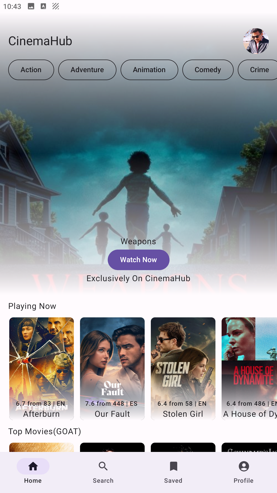
   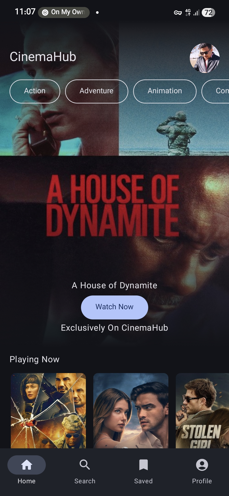
 

---

### 🔍 Search Screen
- Sends user input to the server and displays search results dynamically.  
- Implements a **debounce mechanism** to reduce unnecessary API requests while typing.  
- Displays search results as a grid of movie posters.  
- Clicking on any movie opens its **Details Screen**.

 

   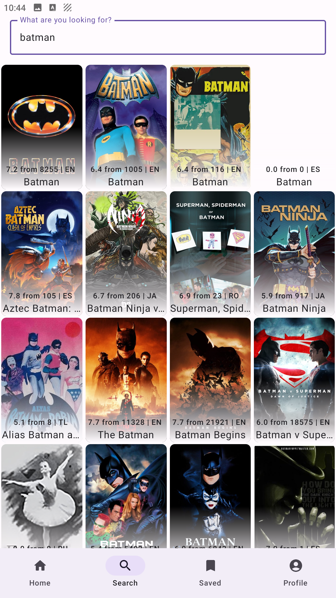
   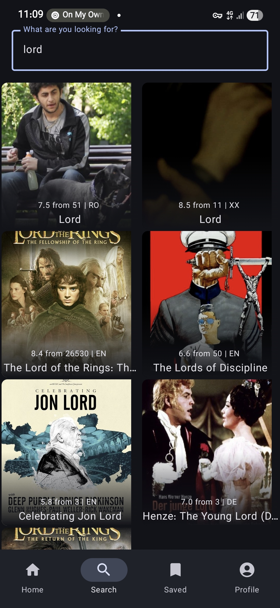
 

---

### 💾 Saved Screen
- Users can save movies to watch later, either online or offline.  
- Implemented using **Room Database** for local storage.

 

   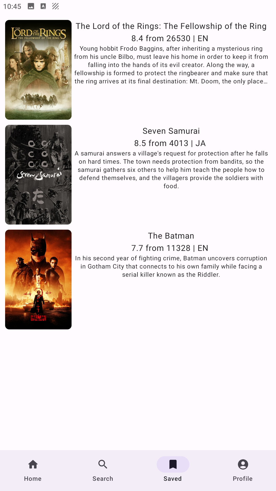
   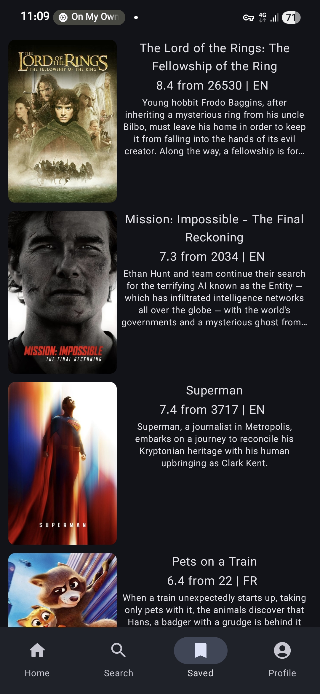
 

---

### 🎭 Discovery Screen
- Displays a list of movies filtered by the genre selected by the user.  
- All data is loaded live from the API.
 

   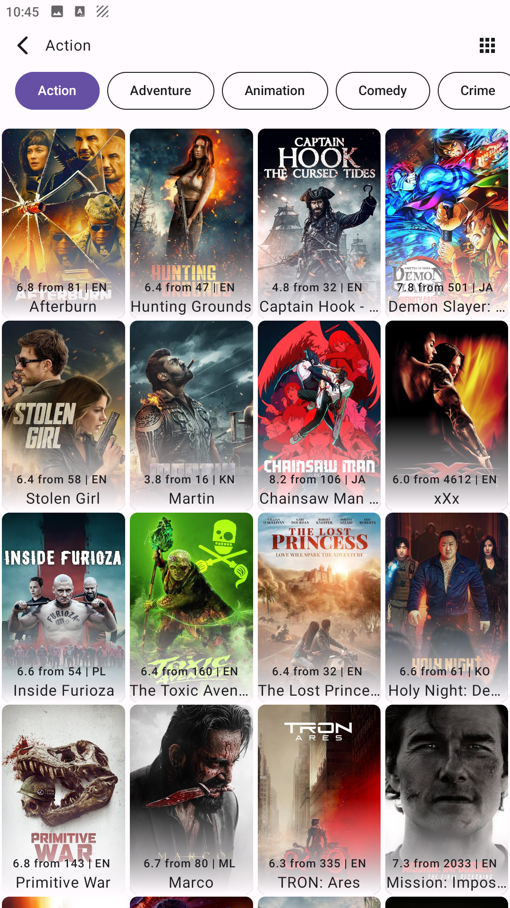
   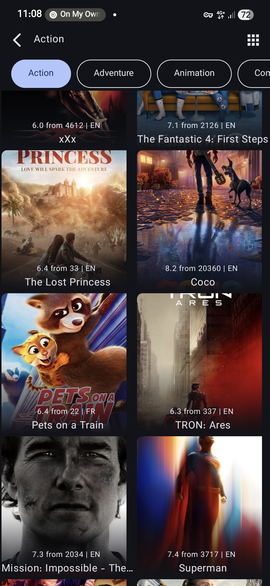
 

---

### 📄 Details Screen
- Shows full movie details, including:
  - Trailers  
  - Posters (implemented as a sliding banner)  
  - Cast list  
  - Movie overview  
  - Ratings and scores  
- Built with responsive UI components in Jetpack Compose.
 

   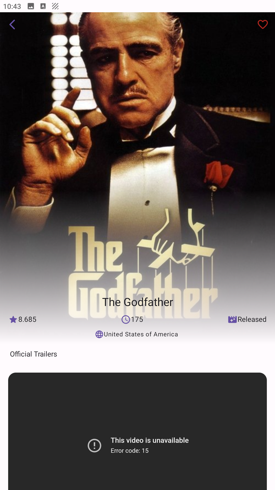
   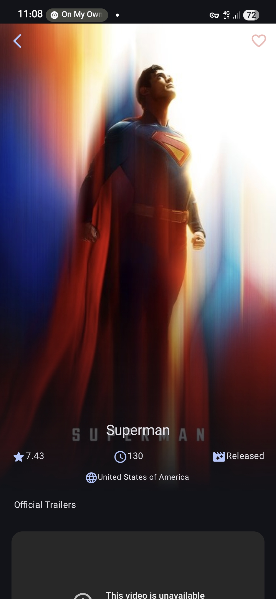
 

---

## OTHER SCREENSHOTS
 

  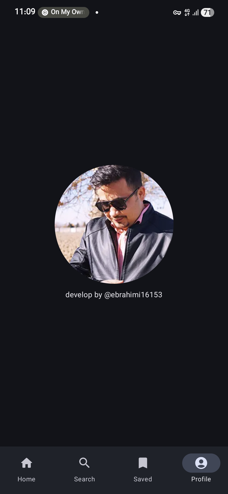
  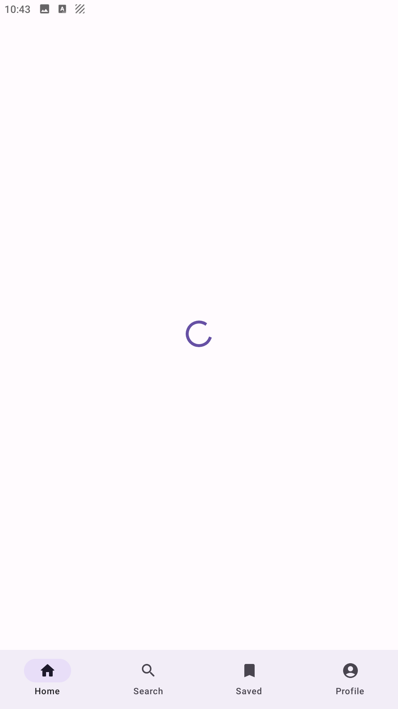
  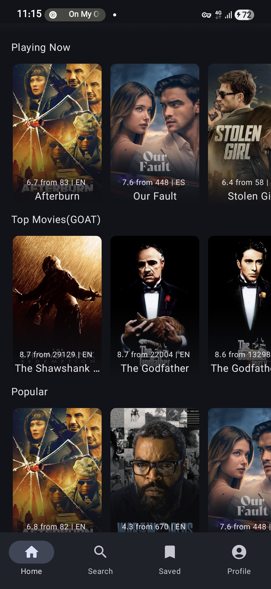
 

---

## 📦 Installation
Download the latest APK file from the link below:

➡️ [Download Version 1.0](./app/release/app-release.apk)

After downloading, install the file on your Android device.  
If needed, enable **“Allow installation from unknown sources”** in your device settings.

---

## 📬 Contact
If you have any feedback, suggestions, or find a bug, feel free to open an issue or contact me directly:

📧 [ebrahimi2723@gmail.com](mailto:ebrahimi2723@gmail.com)
🌐 [LinkedIn Profile](https://linkedin.com/in/yourname)
